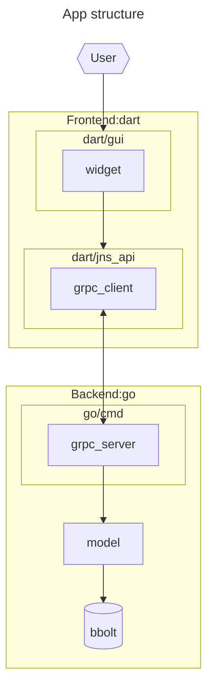

```mermaid
---
title: App structure
---
flowchart

User{{User}} --> GUI

subgraph Frontend[Frontend:dart]
    subgraph GUI[dart/gui]
        widget
    end
    widget --> jns_api
    subgraph jns_api[dart/jns_api]
        grpc_client
    end
end

grpc_client <--> grpc_server

subgraph backend[Backend:go]
    subgraph cmd[go/cmd]
        grpc_server
    end
    grpc_server --> model --> bbolt[(bbolt)]
end
```