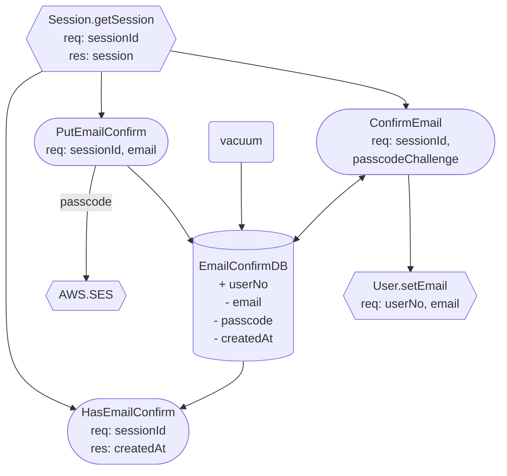
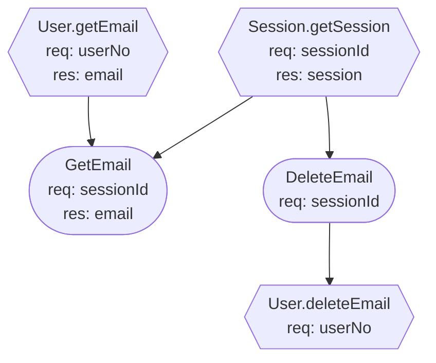
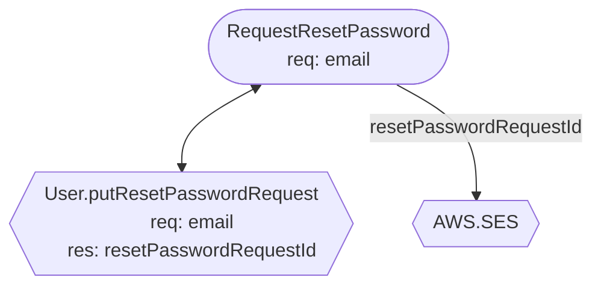
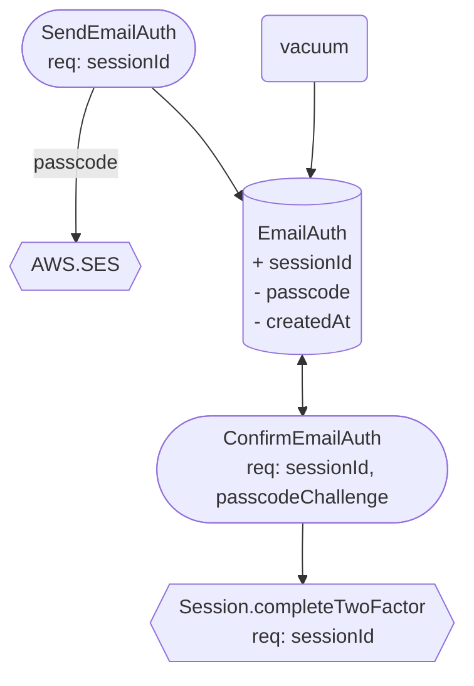

# Email

## Confirm

```mermaid
flowchart

%% DB
DB1[(EmailConfirmDB
    + userNo
    - email
    - passcode
    - createdAt)]

%% API
API1([PutEmailConfirm
    req: sessionId, email])

API2([ConfirmEmail
    req: sessionId, passcodeChallenge])

API4([HasEmailConfirm
    req: sessionId
    res: createdAt])

%% private API
pAPI1(vacuum)

%% external API
xAPI1{{Session.getSession
    req: sessionId
    res: session}}

xAPI2{{AWS.SES}}

xAPI3{{User.setEmail
    req: userNo, email}}

%% Arrow

DB1 --> API4
xAPI1 --> API4

API1 --passcode--> xAPI2
xAPI1 --> API1
API1 --> DB1


API2 <--> DB1
xAPI1 --> API2
API2 --> xAPI3

pAPI1 --> DB1
```

## Access

```mermaid
flowchart

API1([GetEmail
    req: sessionId
    res: email])

API2([DeleteEmail
    req: sessionId])

%% external API
xAPI1{{Session.getSession
    req: sessionId
    res: session}}

xAPI2{{User.getEmail
    req: userNo
    res: email}}

xAPI3{{User.deleteEmail
    req: userNo}}

xAPI1 --> API1
xAPI2 --> API1

xAPI1 --> API2
API2 --> xAPI3
```

## ResetPassword

```mermaid
flowchart

API1([RequestResetPassword
    req: email])

xAPI1{{AWS.SES}}

xAPI2{{User.putResetPasswordRequest
    req: email
    res: resetPasswordRequestId}}

API1 <--> xAPI2
API1 --resetPasswordRequestId--> xAPI1
```

## TwoFactor

```mermaid
flowchart
DB1[(EmailAuth
    + sessionId
    - passcode
    - createdAt)]

API1([SendEmailAuth
    req: sessionId])

API2([ConfirmEmailAuth
    req: sessionId, passcodeChallenge])

pAPI1(vacuum)

%% external API
xAPI1{{AWS.SES}}

xAPI2{{Session.completeTwoFactor
    req: sessionId}}

API1 --passcode--> xAPI1
API1 --> DB1
pAPI1 --> DB1

DB1 <--> API2
API2 --> xAPI2

```