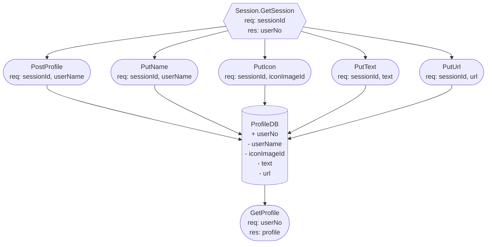

# Profile

```mermaid
flowchart

DB1[(ProfileDB
    + userNo
    - userName
    - iconImageId
    - text
    - url)]

API1([PutIcon
    req: sessionId, iconImageId])

API2([PutText
    req: sessionId, text])

API3([PutUrl
    req: sessionId, url])

API4([GetProfile
    req: userNo
    res: profile])

API5([PostProfile
    req: sessionId, userName])

API6([PutName
    req: sessionId, userName])

xAPI1{{Session.GetSession
    req: sessionId
    res: userNo}}

API5 --> DB1
xAPI1 --> API5

API6 --> DB1
xAPI1 --> API6

xAPI1 --> API1
API1 --> DB1

API2 --> DB1
xAPI1 --> API2

API3 --> DB1
xAPI1 --> API3

DB1 --> API4
```