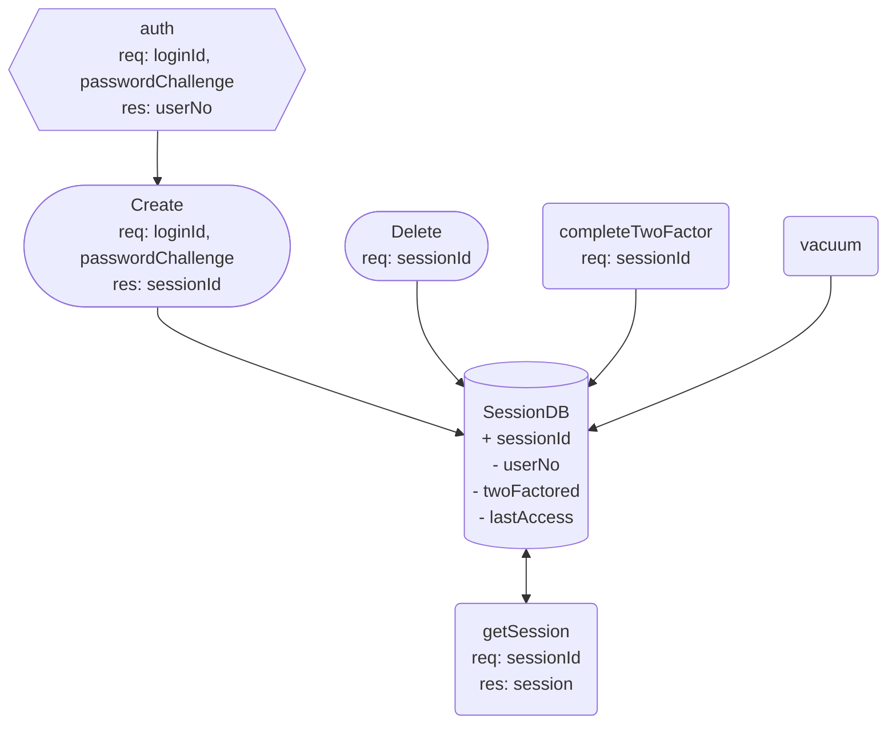

# Session

```mermaid
flowchart

%% DB
DB1[(SessionDB
    + sessionId
    - userNo
    - twoFactored
    - lastAccess)]

%% API
API1([Create
    req: loginId, passwordChallenge
    res: sessionId])

API2([Delete
    req: sessionId])

%% private API
pAPI1(vacuum)

pAPI2(getSession
    req: sessionId
    res: session)

pAPI3(completeTwoFactor
    req: sessionId)


%% external API
xAPI1{{auth
    req: loginId, passwordChallenge
    res: userNo}}

%% Arrow

xAPI1 --> API1
API1 --> DB1

DB1 <--> pAPI2

API2 --> DB1
pAPI3 --> DB1
pAPI1 --> DB1

```