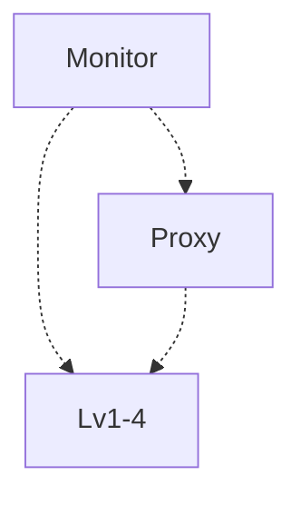
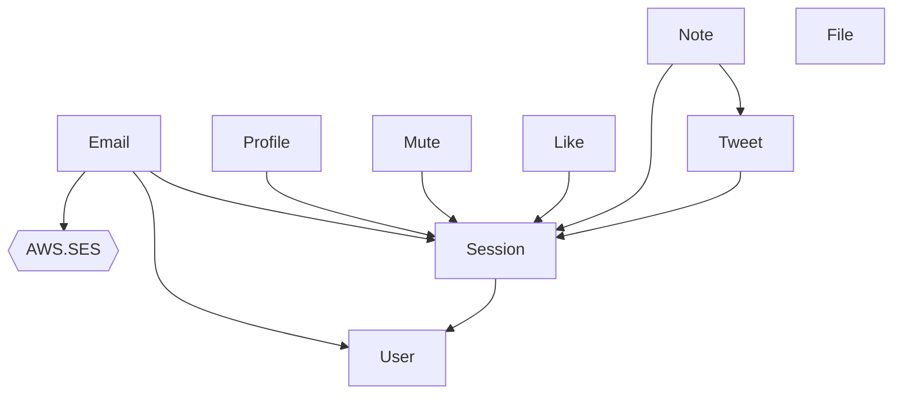

# Microservice
## Boot Sequence
- Lv0. Monitor
- Lv1. [User](./user/README.md), [File](./file/README.md)
- Lv2. [Session](./session/README.md)
- Lv3. [Email](./email/README.md), [Profile](./profile/README.md), [Mute](./mute/README.md), [Like](./like/README.md), [Tweet](./tweet/README.md)
- Lv4. [Note](./note/README.md)
- Lv9. Proxy

## Dependencies
### Lv0 & Lv9

### Lv1-4
