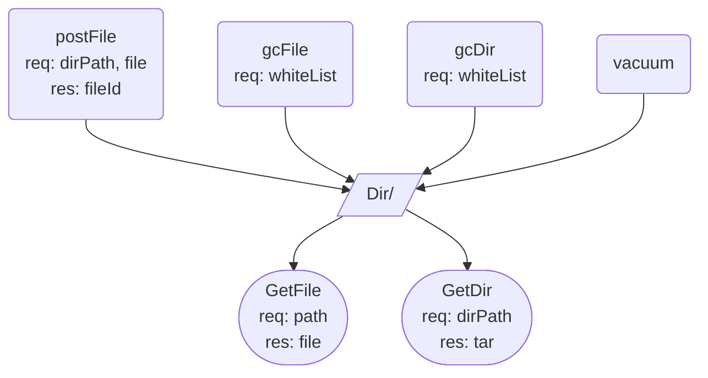

# File

```mermaid
flowchart

DIR1[/Dir//]

API1([GetFile
	req: path
	res: file])

API2([GetDir
	req: dirPath
	res: tar])

pAPI1(postFile
	req: dirPath, file
	res: fileId)

pAPI2(gcFile
	req: whiteList)

pAPI3(gcDir
	req: whiteList)

pAPI4(vacuum)

pAPI1 --> DIR1
pAPI2 --> DIR1
pAPI3 --> DIR1
pAPI4 --> DIR1

DIR1 --> API1
DIR1 --> API2
```