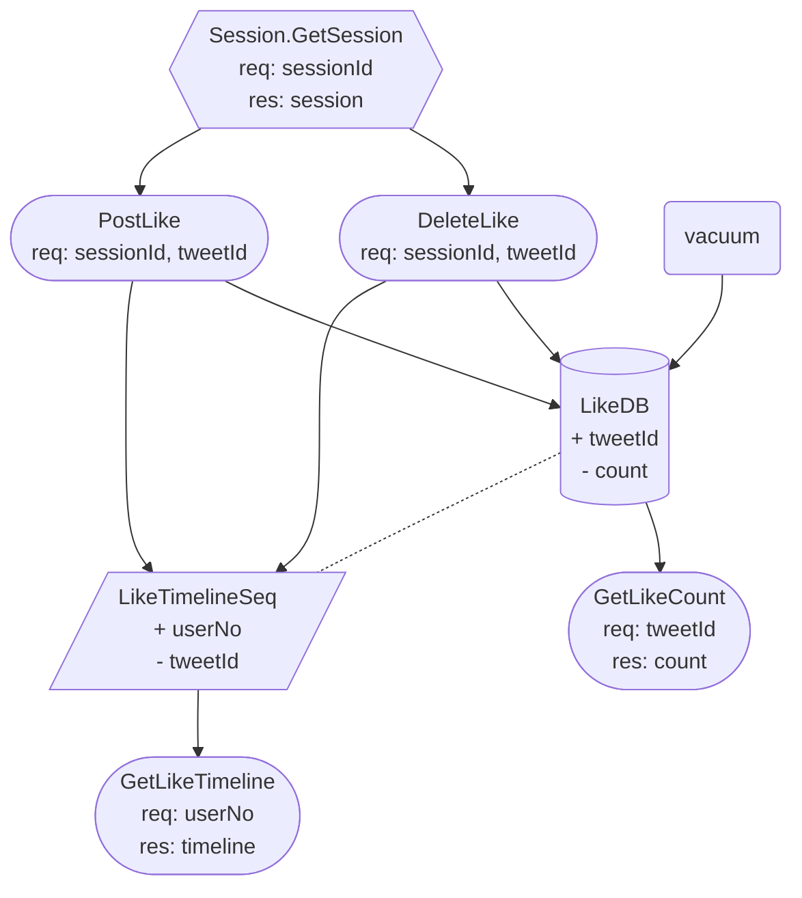

# Like

```mermaid
flowchart

DB1[(LikeDB
	+ tweetId
	- count)]

IDX1[/LikeTimelineSeq
	+ userNo
	- tweetId/]

API1([PostLike
	req: sessionId, tweetId])

API2([DeleteLike
	req: sessionId, tweetId])

API3([GetLikeTimeline
	req: userNo
	res: timeline])

API4([GetLikeCount
	req: tweetId
	res: count])

xAPI1{{Session.GetSession
	req: sessionId
	res: session}}

pAPI1(vacuum)

xAPI1 --> API2
API2 --> DB1
API2 --> IDX1

xAPI1 --> API1
pAPI1 --> DB1

API1 --> DB1
API1 --> IDX1
IDX1 --> API3
DB1 --> API4

DB1 -.- IDX1
```
