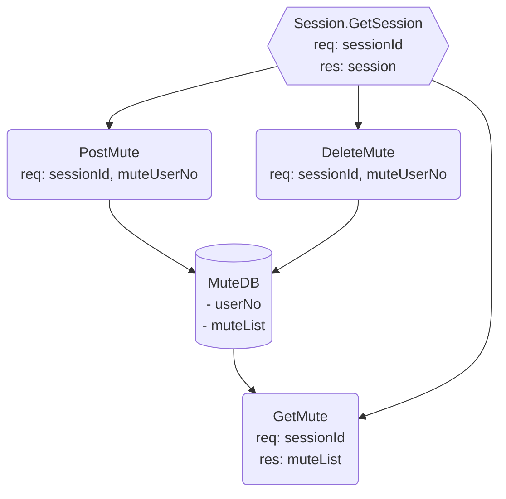

# Mute

```mermaid
flowchart

DB1[(MuteDB
	- userNo
	- muteList)]

API1(PostMute
	req: sessionId, muteUserNo)

API2(GetMute
	req: sessionId
	res: muteList)

API3(DeleteMute
	req: sessionId, muteUserNo)

xAPI1{{Session.GetSession
	req: sessionId
	res: session}}

API1 --> DB1 --> API2
API3 --> DB1

xAPI1 --> API1
xAPI1 --> API2
xAPI1 --> API3
```