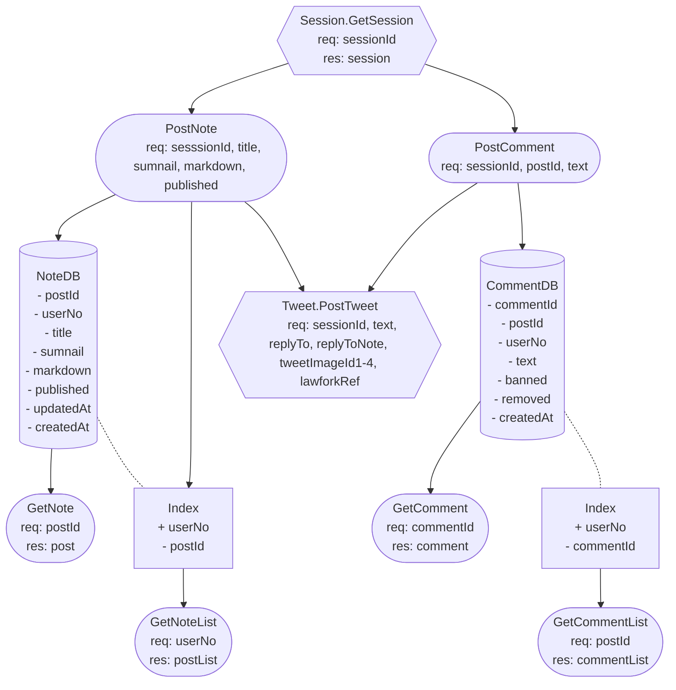

# Note

```mermaid
flowchart

DB1[(NoteDB
	- postId
	- userNo
	- title
	- sumnail
	- markdown
	- published
	- updatedAt
	- createdAt)]

DB2[(CommentDB
	- commentId
	- postId
	- userNo
	- text
	- banned
	- removed
	- createdAt)]

DB3[Index
	+ userNo
	- postId]

DB4[Index
	+ userNo
	- commentId]

API1([PostNote
	req: sesssionId, title, sumnail, markdown, published])

API2([GetNoteList
	req: userNo
	res: postList])

API3([GetNote
	req: postId
	res: post])

API4([PostComment
	req: sessionId, postId, text])

API5([GetCommentList
	req: postId
	res: commentList])

API6([GetComment
	req: commentId
	res: comment])

xAPI1{{Tweet.PostTweet
	req: sessionId, text, replyTo, replyToNote, tweetImageId1-4, lawforkRef}}

xAPI2{{Session.GetSession
	req: sessionId
	res: session}}


%% Layout
DB1 --> API3
DB1 -.- DB3
DB3 --> API2

API1 --> DB1
API1 --> DB3
API1 --> xAPI1
xAPI2 --> API1

API4 --> xAPI1
xAPI2 --> API4
API4 --> DB2

DB4 --> API5
DB2 --> API6
DB2 -.- DB4
```