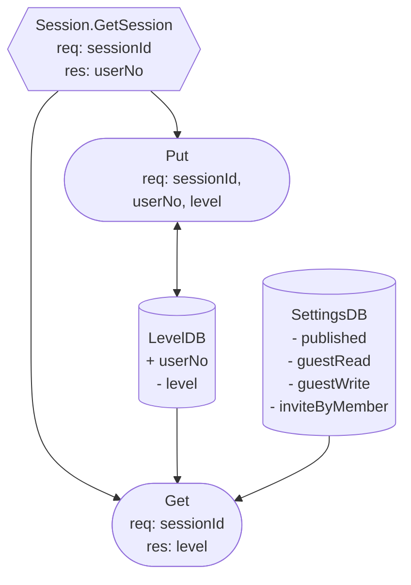

# ChannelRole
## Role Level

### Action
1. Put/Delete Owner
2. Put/Delete Admin
3. Put/Delete Member
4. Invite Member
5. Write Channel
6. Read Channel

7. Set inviteByMember
8. Set guestWrite
9. Set guestRead

### Role & Policy
| Lv.  | Role    | 1 | 2 | 3 | 4 | 5 | 6 | 7 | 8 | 9 |
| ---- | ------- | - | - | - | - | - | - | - | - | - |
| Lv0. | Root    | o | o | o | o | o | o | o | o | o |
| Lv1. | Owner   | - | o | o | o | o | o | o | o | o |
| Lv2. | Admin   | - | - | o | o | o | o | o | o | o |
| Lv3. | Member  | - | - | - | - | o | o | - | - | - |
| Lv4. | Guest   | - | - | - | - | - | - | - | - | - |

### 

## DFD
