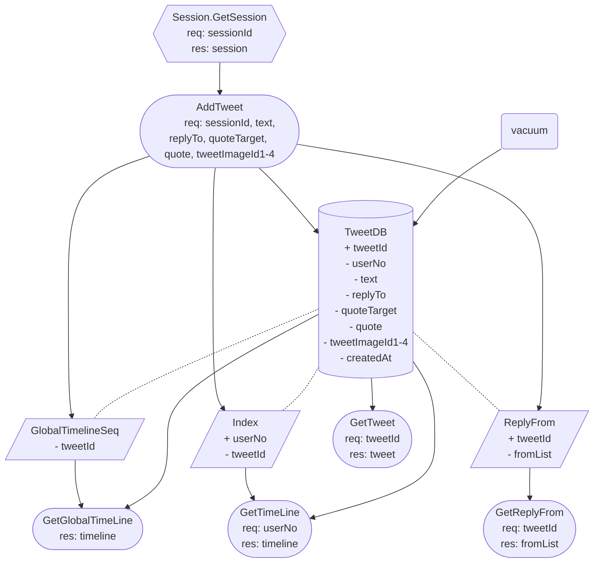

# Tweet

```mermaid
flowchart

%% DB
DB1[(TweetDB
	+ tweetId
	- userNo
	- text
	- replyTo
	- quoteTarget
	- quote
	- tweetImageId1-4
	- createdAt)]

IDX1[/GlobalTimelineSeq
	- tweetId/]

IDX2[/Index
	+ userNo
	- tweetId/]

IDX3[/ReplyFrom
	+ tweetId
	- fromList/]


%% API
API1([AddTweet
	req: sessionId, text, replyTo, quoteTarget, quote, tweetImageId1-4])

API2([GetTweet
	req: tweetId
	res: tweet])

API3([GetGlobalTimeLine
	res: timeline])

API4([GetTimeLine
	req: userNo
	res: timeline])

API5([GetReplyFrom
	req: tweetId
	res: fromList])

xAPI1{{Session.GetSession
	req: sessionId
	res: session}}

pAPI1(vacuum)


%% Layout
pAPI1 --> DB1

DB1 -.- IDX1
DB1 --> API3
DB1 -.- IDX2

API1 --> IDX1
API1 --> DB1
API1 --> IDX2
API1 --> IDX3
xAPI1 --> API1

DB1 --> API4
IDX2 --> API4

DB1 --> API2

IDX1 --> API3

IDX3 --> API5
DB1 -.- IDX3

```