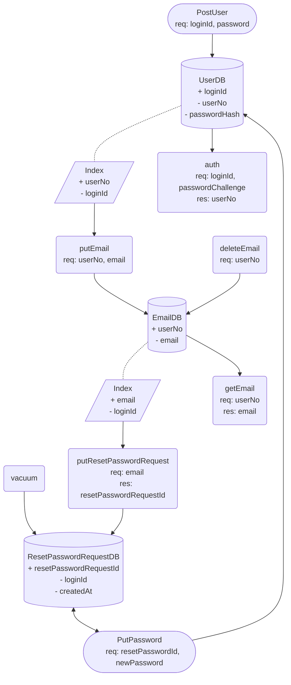

# User
## DFD

## CRUD

### UserDB
| name        | C | R | U | D |
| ----        | - | - | - | - |
| PostUser    | o | . | . | . |
| auth        | . | o | . | . |
| PutPassword | . | . | o | . |

### UserDB Index
| name        | C | R | U | D |
| ----        | - | - | - | - |
| PostUser    | o | . | . | . |
| putEmail    | . | o | . | . |

### EmailDB
| name        | C | R | U | D |
| ----        | - | - | - | - |
| putEmail    | o | . | o | . |
| getEmail    | . | o | . | . |
| deleteEmail | . | . | . | o |

### EmailDB Index
| name                    | C | R | U | D |
| ----                    | - | - | - | - |
| putEmail                | o | . | . | . |
| putResetPasswordRequest | . | o | . | . |
| deleteEmail             | . | . | . | o |

### ResetPasswordRequestDB
| name                    | C | R | U | D |
| ----                    | - | - | - | - |
| putResetPasswordRequest | o | . | o | . |
| PutPassword             | . | o | . | o |
| vacuum                  | . | . | . | o |