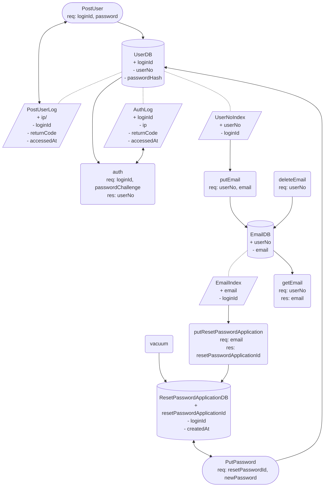

# User
## DFD

## CRUD

### UserDB
| name        | C | R | U | D |
| ----        | - | - | - | - |
| PostUser    | o | . | . | . |
| auth        | . | o | . | . |
| PutPassword | . | . | o | . |

### UserDB.UserNoIndex
| name        | C | R | U | D |
| ----        | - | - | - | - |
| PostUser    | o | . | . | . |
| putEmail    | . | o | . | . |

### UserDB.PostUserLog
| name        | C | R | U | D |
| ----        | - | - | - | - |
| PostUser    | o | o | o | . |

### UserDB.AuthLog
| name        | C | R | U | D |
| ----        | - | - | - | - |
| auth        | o | o | o | . |

### EmailDB
| name        | C | R | U | D |
| ----        | - | - | - | - |
| putEmail    | o | . | o | . |
| getEmail    | . | o | . | . |
| deleteEmail | . | . | . | o |

### EmailDB.EmailIndex
| name                        | C | R | U | D |
| ----                        | - | - | - | - |
| putEmail                    | o | . | . | . |
| putResetPasswordApplication | . | o | . | . |
| deleteEmail                 | . | . | . | o |

### ResetPasswordApplicationDB
| name                        | C | R | U | D |
| ----                        | - | - | - | - |
| putResetPasswordApplication | o | . | o | . |
| PutPassword                 | . | o | . | o |
| vacuum                      | . | . | . | o |